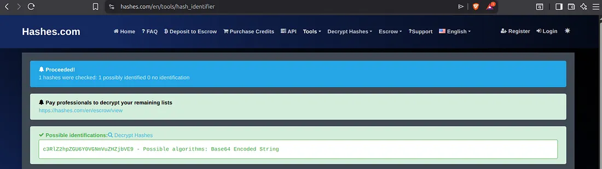
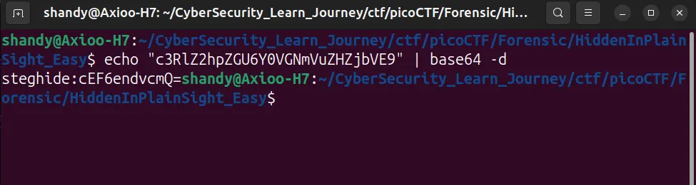
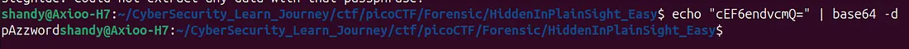
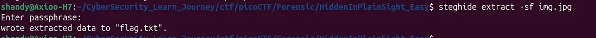
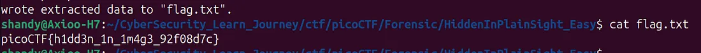

# picoCTF - Forensic Challenge: Hidden In Plainsight (easy)

## 📝 Challenge Description

Tantangan ini memberikan sebuah file gambar JPG yang terlihat biasa saja, namun berisi informasi rahasia yang disembunyikan menggunakan teknik steganogr>

## 🛠️ Tools Used

-   **ExifTool**: Analisis metadata file.
    ```
    sudo apt install exiftool
    ```
-   **Base64**: Mendecode string rahasia di dalam terminal Ubuntu.
    ```
    echo "Kode kamu" | base64 -d
    ```
-   **Steghide**: Mengekstrak data tersembunyi dari dalam gambar.
    ```
    steghide extract -sf file.jpg


## 🚀 Step-by-Step Investigation
**1. Metadata Analisis**
Langkah awal dimulai dengan mengecek metadata file menggunakan `exiftool`. Ditemukan sebuah string mencurigakan pada kolom **Comment**:

Bash

```
exiftool img.jpg
# Output Comment: c3Rlc2hpZGU6Y0VGNVVuVnZHVzZiYjVE
```


**2. Cek Tipe Encoding**
Langkah untuk memeriksa apa arti dari kode tersebut kita perlu mengetahui tipe encoding yang digunakan dalam kolom comment tersebut. menggunakan website  [hashes.com](http://hashes.com/)  untuk menemukan tipe encoding tersebut dan  mendapatkan tipe encodingnya adalah  **Base64 Encoding**.



**3. Decoding Comment Base64 Sebelumnya**
Selanjutnya, karena encoding bersifat dua arah yang artinya bisa dikembalikan lagi ke bentuk semula kita melakukan proses decoding di terminal dengan menggunakan fungsi **echo.** Kita mendapatkan kode passphrase steghide untuk di ekstrak. Tetapi, passphrase tidak dapat langsung digunakan karena masih berbentuk **Base64 Encoding.**
```
echo "c3RlZ2hpZGU6Y0VGNmVuZHZjbVE9" | base64 -d
#output : steghide:cEF6endvcmQ=
```


**4. Decoding pada passphrase steghide**
Kita melakukan decoding pada base64 yang terdapat pada steghide agar mendapatkan passphrase yang tepat. Dan kita mendapatkan kode yaitu “pAZzword” sebagai passphrase yang tepat
```
echo "cEF6endvcmQ=" | base64 -d
#Output : pAZzword
```


**5. Melakukan ekstraksi steghide untuk mengetahui Flag**
Setelah memasukkan passphrase yang tepat maka data yang di ekstrak (Informasi Tersembunyi) akan ditulis ke dalam file yang bernama **“flag.txt”** lalu dengan fungsi cat kita dapat melihat flag yang terdapat di dalam file image img.jpg
```
steghide extract -sf img.jpg
```


**6. Mendapatkan File flag,txt dan membuka flag**
kita telah mendapatkan flag yg kita cari dan buka menggunakan cat 
```
cat flag.txt
#Output : picoCTF{h1dd3n_1n_1m4g3_92f08d7c}
```

