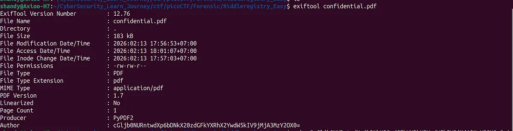
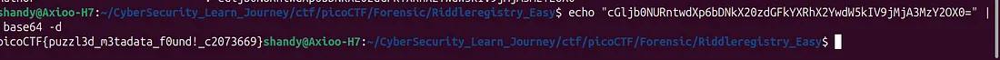

# picoCTF - Forensic Challenge: Riddle Registry (easy)

## 📝 Challenge Description  


Riddle registry adalah case CTF pada picoCTF yang memberikan suatu file PDF dengan isi yang terlihat memiliki isi kata kata yang random. tetapi dibalik itu semua terdapat flag/informasi rahasia yang bisa diketahui melalui metadata yang dimiliki oleh file.

## 🛠️ Tools Used

-   **ExifTool**: Analisis metadata file.
    ```
    sudo apt install exiftool
    ```
-   **Base64**: Mendecode string rahasia di dalam terminal Ubuntu.
    ```
    echo "Kode kamu" | base64 -d
    ```

## 🚀 Step-by-Step Investigation
**1. Metadata Analisis**  
Langkah awal dimulai dengan mengecek metadata file menggunakan `exiftool`. Ditemukan sebuah string mencurigakan pada kolom **Author**:

Bash

```
exiftool confidential.pdf
# Output Comment: cGljb0NURntwdXp6bDNkX20zdGFkYXRhX2YwdW5kIV9jMjA3MzY2OX0=
```



**2. Decoding author Base64 Sebelumnya**  
Selanjutnya, karena encoding bersifat dua arah yang artinya bisa dikembalikan lagi ke bentuk semula kita melakukan proses decoding di terminal dengan menggunakan fungsi **echo.** kita melihat apa flag yang terdapat pada base64 encoding tersebut
```
echo "cGljb0NURntwdXp6bDNkX20zdGFkYXRhX2YwdW5kIV9jMjA3MzY2OX0=" | base64 -d
#output : picoCTF{puzzl3d_m3tadata_f0und!_c2073669}
```



