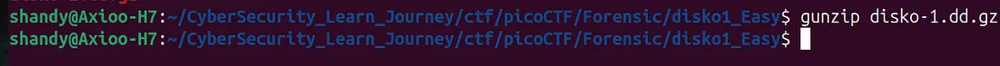
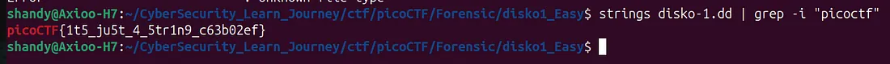

# picoCTF - Forensic Challenge: Disko-1 (easy)

## 📝 Challenge Description  

Disko 1 adalah case ctf yang bertujuan untuk menemukan flag di dalam sebuah file bertipe disk. File yang telah di zip menggunakan GNU Zip ini perlu diekstrak terlebih dahulu dengan menggunakan gunzip. Untuk melihat flag pada file disk ini kita perlu mengubah disk ini menjadi tipe data strings dan mencari kata kata yang sesuai yaitu “picoflag”

## 🛠️ Tools Used

-   **Extract GNU ZIP**: Mengekstrak file zip yang bertipe GNU.
    ```
    sudo apt install gunzip
    gunzip nama_file.dd.gz
    ```
    
-   **strings**: Berfungsi untuk mengambil karakter di dalam suatu file yang dapat dibaca (string)
    ```
    strings disk.dd
    ```
-   **grep**: Berfungsi untuk mengambil kata tertentu yang telah ditetapkan.
    ```
    grep -i "pico"
    ```
    
## 🚀 Step-by-Step Investigation
**1. Ekstrak File**  
Langkah awal dimulai dengan mengekstrak file bertipe `.gz` dengan menggunakan fungsi `gunzip` :

Bash

```
gunzip disko-1.dd.gz
```



**2. Mengambil karakter yang diinginkan pada file**  
Selanjutnya kita perlu mengubah file disk tersebut menjadi string agar kita bisa mengetahui apa flag tersembunyi yang terdapat di dalam disk tersebut. Dengan memanfaatkan fungsi strings yang mengubah file menjadi format string kemudian dengan pipeline fungsi grep yang berfungsi untuk mencari kata yang dinginkan kita bisa mendapatkan flag yg kita inginkan.
```
strings disko-1.dd | grep -i "picoCTF"
#output : picoCTF{1t5_ju5t_4_5tr1n9_c63b02ef}
```



