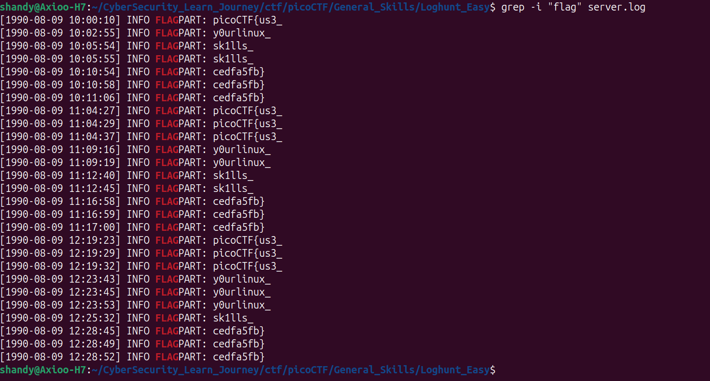

# picoCTF - General Skill Challenge: Log Hunt (easy)

## 📝 Challenge Description  


Log Hunt adalah case CTF pada picoCTF yang bertujuan menemukan flag pada  file log yang memiliki isi secara acak dengan menggunakan filter kata. fungsi yang digunakan pada hal ini adalah fungsi grep 
## 🛠️ Tools Used

-   **grep**: Mengambil kata atau kalimat yang diinginkan.
    ```
    grep -i "flag" server.log
    ```

## 🚀 Step-by-Step Investigation
**1. Mencari kata flag**  
Langkah awal dimulai mencari kata "flag" dengan menggunakan fungsi `grep` pada terminal. dan menemukan flag yang dicari

Bash

```
grep -i "flag" server.log
# Output : picoCTF{us3_y0urlinux_sk1lls_cedfa5fb}
```




