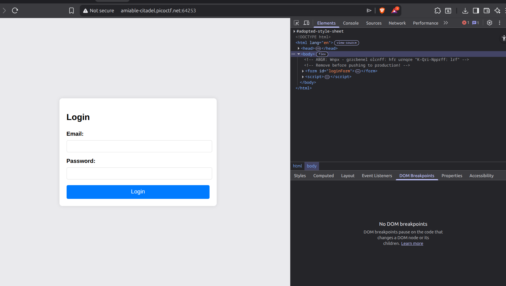
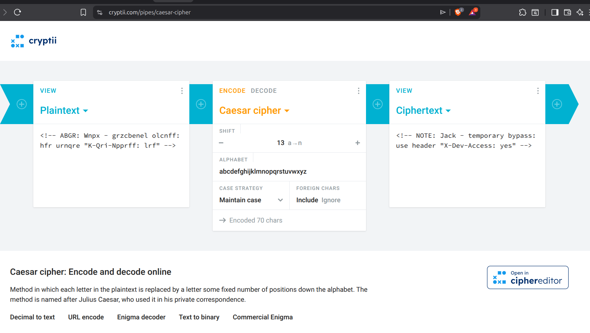
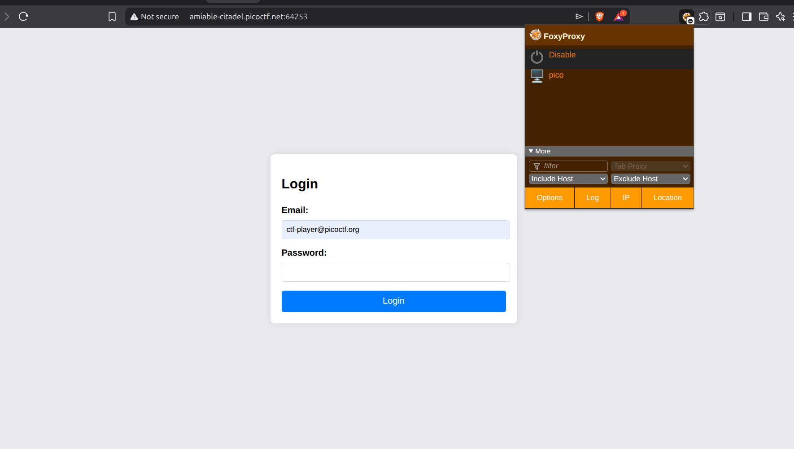
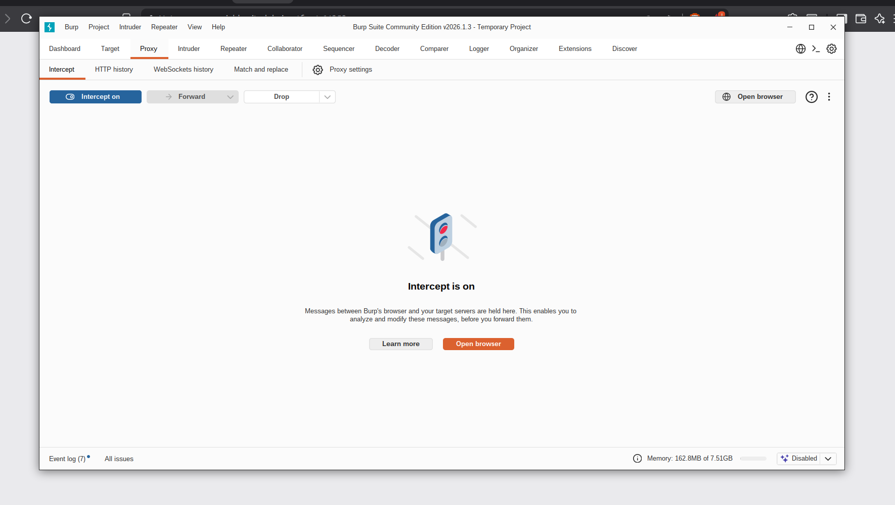
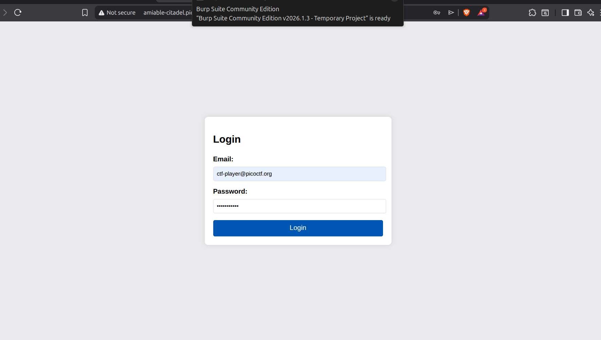

# picoCTF - Web Exploitation Challenge: Crack The Gate 1 (easy)

## 📝 Challenge Description  
Pada case Crack The Gate 1 picoCTF, kita diarahkan untuk melakukan web exploitation terhadap suatu page login. dengan melakukan inspect pada halaman web dengan tombol `ctrl + shift + i` kita akan melihat bagian html dan lain lain dari web lalu mencari suatu celah yang bisa dimanfaatkan sebagai petunjuk. Burpsuit digunakan untuk mencegat paket langsung dikirimkan ke server dengan tujuan untuk memodifikasi request yang akan diberikan ke server sesuai dengan output yang kita mau.

## 🛠️ Tools Used

-   **Burpsuit**: Menncegat paket yang lewat lalu memodifikasinya.

-   **Inspect Page**:  Melihat isi dari kode sumber (html maupun css).
    ```
    ctrl + shift + i
    ```
-   **cryptii** : Memecahkan cipher text dari hint yg ada

## 🚀 Step-by-Step Investigation
**1. Inspeksi Halaman**  
Langkah awal dimulai dengan Melakukan inspeksi pada halaman untuk mencari celah komentar yang ditinggalkan oleh developer yang akan menjadi petunjuk penting dalam pemecahan masalah : 

```
ctrl + shift + i
```



**2. Pemecahan kode mencurigakan**  
Selanjutnya kita mendapatkan bahwa ada kode yang mencurigakan yaitu `<!-- ABGR: Wnpx - grzcbenel olcnff: hfr urnqre "K-Qri-Npprff: lrf" -->`. Dari hint yang diberikan ini merupakan ciphertext dengan shift sebanyak 13 huruf. dengan menggunakan web online `cryptii` kita memecahkan cipher text. Kita mendapatkan pesan : <!-- NOTE: Jack - temporary bypass: use header "X-Dev-Access: yes" -->. yang dimana berarti kita harus mengedit header dengan menambahkan X-Dev-Access: yes



**3. Membuat Proxy**  
Selanjutnya kita melakukan konfigurasi proxy yang berfungsi untuk membelokkan lalu lintas data dari browser agar melewati Burp Suite sebelum dikirim ke internet. Saya set dengan judul pico melalui port `8080` dan juga username `127.0.0.1`.



**4. Melakukan login dengan password acak**  
Selanjutnya kita melakukan login ke web yang disediakan dengan password acak dengan tujuan untuk mengirimkan paket ke webserver nantinya yang akan dicegat oleh burpsuit untuk dimodifikasi. jangan lupa untuk mengaktifkan mode intercept pada burpsuite agar bisa mencegat paket yang terkirim.



**5. Mengubah isi paket yang dikirimkan melalui burpsuite**  
Setelah berhasil dicegat oleh burpsuite, langkah selanjutnya adalah mengubah isi header dari paket tersebut untuk mendapatkan output yang diinginkan. disini kita menambahkan kata kata `X-Dev-Access : yes` untuk mendapatkan flag yang diinginkan dan lakukan forward untuk melanjutkan meneruskan paket ke server.


**6. Mendapatkan flag**
Setelah melakukan forward, web akan otomatis memberikan flag yg dibutuhkan.


